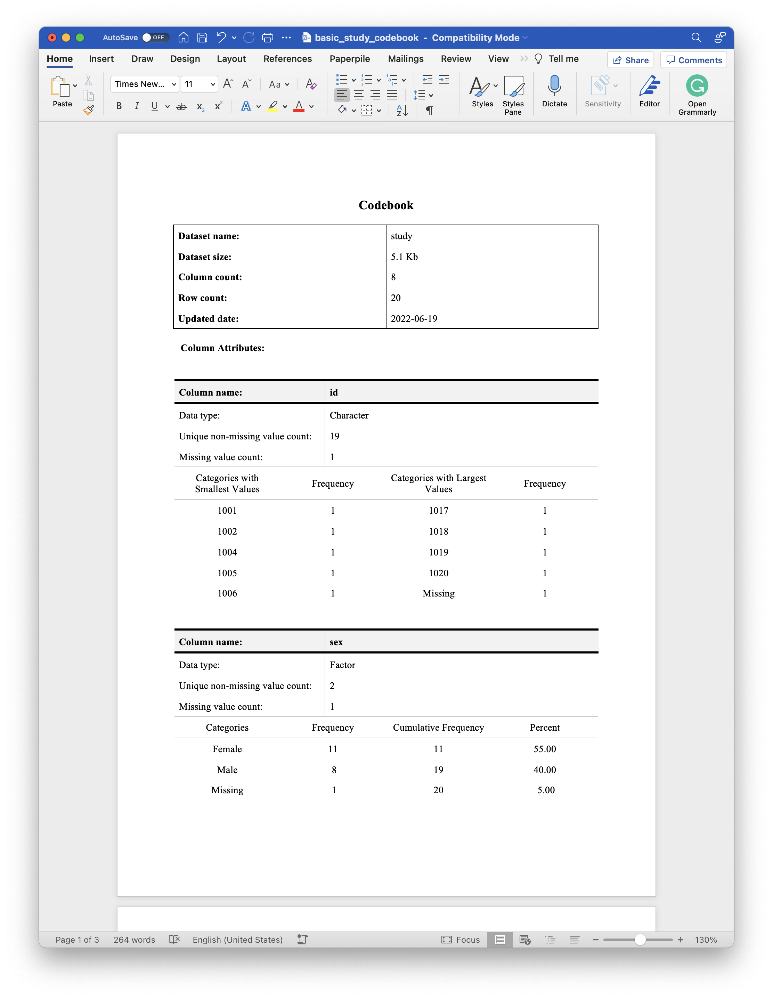

<!-- README.md is generated from README.Rmd. Please edit that file -->

# codebookr

<!-- badges: start -->
<!-- badges: end -->

The `codebookr` package is intended to make it easy for users to create
codebooks (also calld data dictionaries) directly from a data frame.

## Installation

You can install the development version of codebookr like so:

``` r
# install.packages("devtools")
devtools::install_github("brad-cannell/codebook")
```

## codebookr functions

-   **codebook:** The codebook function assists with the creation of a
    codebook for a given data frame.

-   **cb_add_col_attributes:** Add arbitrary attributes to columns
    (e.g., description, source, column type). These attributes can later
    be accessed to fill in the column attributes table.

## Example 1: The most basic use case

We will start by demonstrating a complete, bare minimum example without
any modification to any of the default values is our example data or in
the `codebook()` function. After viewing this example, we will
demonstrate several ways to improve the codebook document by adding
attributes to our data frame. We will also demonstrate the effects of
adjusting some of `codebook()`s default values as well as demonstrate
some techniques to make the codebook creation process more efficient in
a couple of common use cases.

``` r
library(codebookr)
library(dplyr, warn.conflicts = FALSE)
```

### Load data

For the purposes of making a self-contained example, the `codebookr`
package comes with a small example data frame that is intended to have
some of the features of real study data. We will use it to demonstrate
how to use `codebookr` below.

``` r
# Load example data
data(study)
```

``` r
glimpse(study)
#> Rows: 20
#> Columns: 8
#> $ id      <chr> "1001", "1002", NA, "1004", "1005", "1006", "1007", "1008", "1…
#> $ sex     <fct> Female, Female, Female, NA, Female, Male, Male, Male, Female, …
#> $ date    <date> 2021-10-12, 2021-09-23, 2021-10-13, 2021-10-19, NA, 2021-10-1…
#> $ time    <drtn> 32200 secs, 48369 secs, 33862 secs, 31046 secs, 33659 secs, 4…
#> $ days    <int> 3, 15, 21, 5, 8, NA, 10, 18, 10, 12, 2, 10, 12, 20, 14, 17, 14…
#> $ height  <dbl> 81.25571, 68.15227, 58.79282, 72.81303, 69.61109, 71.05764, NA…
#> $ likert  <int> 5, 3, 4, 4, 1, 4, 1, 3, 4, 3, 5, 4, 4, 4, 1, 2, 3, 4, 3, 1
#> $ outcome <lgl> TRUE, FALSE, FALSE, TRUE, TRUE, FALSE, TRUE, TRUE, FALSE, FALS…
```

### Pass the data frame to the `codebook` function

In this first example, we will simply pass the `study` data frame to the
`codebook()` function without making any alterations. We will save the
resulting `rdocx` object (described in greater detail below) in our
global environment as the `study_codebook` object.

``` r
study_codebook <- codebook(study)
```

### Create the Word codebook document

Finally, we will pass the `study_codebook` object we just created to the
`print()` function along with the path to Word document we want to
create. We have to make

``` r
print(study_codebook, "basic_study_codebook.docx")
```

The code above produces the following document, which you can click to
view/download on Dropbox. You may also download it from the files pane
above.

[](https://www.dropbox.com/s/qcijxgyeh4ib4d3/basic_study_codebook.docx?dl=0)

## Example 2: A few more details

The previous example gave us a complete codebook, but there’s a lot of
room for improvement. This example is still pretty simple, but it
demonstrates how to use the `codebookr` package to make a codebook from
a **labeled** data frame.

Once again, we will begin by loading the example `study` data.

``` r
# Load example data
data(study)
```

``` r
glimpse(study)
#> Rows: 20
#> Columns: 8
#> $ id      <chr> "1001", "1002", NA, "1004", "1005", "1006", "1007", "1008", "1…
#> $ sex     <fct> Female, Female, Female, NA, Female, Male, Male, Male, Female, …
#> $ date    <date> 2021-10-12, 2021-09-23, 2021-10-13, 2021-10-19, NA, 2021-10-1…
#> $ time    <drtn> 32200 secs, 48369 secs, 33862 secs, 31046 secs, 33659 secs, 4…
#> $ days    <int> 3, 15, 21, 5, 8, NA, 10, 18, 10, 12, 2, 10, 12, 20, 14, 17, 14…
#> $ height  <dbl> 81.25571, 68.15227, 58.79282, 72.81303, 69.61109, 71.05764, NA…
#> $ likert  <int> 5, 3, 4, 4, 1, 4, 1, 3, 4, 3, 5, 4, 4, 4, 1, 2, 3, 4, 3, 1
#> $ outcome <lgl> TRUE, FALSE, FALSE, TRUE, TRUE, FALSE, TRUE, TRUE, FALSE, FALS…
```

### Column types

Although R recognizes many different column types, most of which the
`study` data contains, `codebook` classifies all columns as one of four
types and uses these categories to determine which descriptive
statistics to use in the codebook document:

1.  **Categorical with many different categories**, for example the `id`
    column of the `study` data frame.  
2.  **Categorical with few different categories**, for example the
    `gender` column of the `study` data frame.  
3.  **Time**, for example the `date` column of the `study` data frame.  
4.  **Numeric**, for example the `height` column of the `study` data
    frame.

Here are the default summary statistics returned by the `codebook()`
function for each of the column types list above:

#### Categorical variables with many different categories

| lowest_cats | lowest_freq | highest_cats | highest_freq |
|:------------|------------:|:-------------|-------------:|
| 1001        |           1 | 1017         |            1 |
| 1002        |           1 | 1018         |            1 |
| 1004        |           1 | 1019         |            1 |
| 1005        |           1 | 1020         |            1 |
| 1006        |           1 | Missing      |            1 |

#### Categorical variables with few different categories

| cat     | n   | cum_freq | percent |
|:--------|:----|:---------|:--------|
| Female  | 11  | 11       | 55.00   |
| Male    | 8   | 19       | 40.00   |
| Missing | 1   | 20       | 5.00    |

#### Date/Time variables

| Statistic | Value      | Frequency | Percentage |
|:----------|:-----------|:----------|:-----------|
| Minimum   | 2021-09-21 | 2         | 10.00      |
| Mode      | 2021-09-23 | 3         | 15.00      |
| Maximum   | 2021-10-26 | 2         | 10.00      |

#### Numeric variables

| Min   | Mean  | Median | Max   | SD   |
|:------|:------|:-------|:------|:-----|
| 58.79 | 73.54 | 73.39  | 84.61 | 6.90 |

### Add column attributes to the data frame you want to document with a codebook

Typically, though not necessarily (see [What if the variables already
have labels?](#already-labeled%7D)), the first step in creating your
codebook will be to add column attributes to your data. The
`cb_add_col_attributes()` function is a convenience function that allows
you to add arbitrary attributes to columns (e.g., description, source,
column type). These attributes can later be accessed to fill in the
column attributes table of the codebook document. Column attributes
*can* serve a similar function to variable labels in SAS or Stata;
however, you can assign many different attributes to a column and they
can contain any kind of information you want.

The arguments to `cb_add_col_attributes()` are:

-   **df:** The data frame containing the column you want to add the
    attribute to.  
-   **.x:** The name of the column you want to add the attribute to in
    `df`.  
-   **…:** Arbitrary list of attributes (i.e., attribute = “value”).

🔴 Mention the special attributes and add attributes to the rest of the
columns.

``` r
study <- study %>%
  cb_add_col_attributes(
    id,
    description = "Study identification variable"
  ) %>%

  cb_add_col_attributes(
    sex,
    description = "Biological sex of the participant assigned at birth.",
    col_type = "Categorical"
  ) %>%

  cb_add_col_attributes(
    date,
    description = "Date of enrollment into study."
  ) %>%

  cb_add_col_attributes(
    height,
    description = "Participant's height in inches at date of enrollment."
  )
#> The following attribute(s) are being added to a variable in the data frame for the first time: description. If you believe this/these attribute(s) were previously added, then check for a typo in the attribute name. If you are adding this/these attribute(s) for the first time, you can probably safely ignore this message.
#> The following attribute(s) are being added to a variable in the data frame for the first time: col_type. If you believe this/these attribute(s) were previously added, then check for a typo in the attribute name. If you are adding this/these attribute(s) for the first time, you can probably safely ignore this message.
```

### Create a Word codebook document

Now that we’ve added a couple of attributes the data frame we want to
document in our codebook contains attributes that Under the hood,
`codebookr` uses the
[flextable](https://ardata-fr.github.io/flextable-book/) and
[officer](https://davidgohel.github.io/officer/index.html) packages to
create the Word codebook.

The arguments to the `codebook()` function are:

-   **df:** The saved file at `path`, read into memory as a data
    frame.  
-   **title:** An optional title that will appear at the top of the Word
    codebook document.  
-   **subtitle:** An optional subtitle that will appear at the top of
    the Word codebook document.  
-   **description:** An optional text description of the dataset that
    will appear on the first page of the Word codebook document.

🔴 Start with the most basic codebook. We can build it out later.

``` r
study_codebook <- codebook(df = study)
```

The `codebook()` function returns an [rdocx
object](https://davidgohel.github.io/officer/reference/read_docx.html)
that can be printed to a Word document. This functionality comes from
[David Gohel’s incredible `officer`
package](https://davidgohel.github.io/officer/index.html). The final
step in creating the Word document is to
[print](https://davidgohel.github.io/officer/reference/read_docx.html)
it like this:

``` r
print(x = study_codebook, target = "study_codebook.docx")
```

Where `x` is the rdocx object and `target` is a path for the Word
document you want to create (which may or may not already exist). The
code above produces the following document, which you can click to
view/download on Dropbox. You may also download it from the files pane
above.

🔴 **Note:** `Column type` is the type *you* say it is (e.g.,
categorical or numeric), `Data type` is what the *computer* says it is
(e.g., character, integer). (show example in Word table)

``` r
study_codebook <- codebook(
  df = study,
  title = "My Example Study",
  subtitle = "A Subtitle for My Example Study Codebook"
)
```

### What if you have a lot of variables?

Get a chunk of code for each column in the data and then copy and paste
below.

``` r
for (i in seq_along(names(study))) {
cat(paste0('
  codebook_add_col_attributes( \n    ',
    names(study)[i], ', \n    ',
    'description = ""
  ) %>%
'))
}
```

### What if the variables already have labels?

It’s possible that you’ve already added column attributes to your data
that you want `codebook` to use. More likely, you have a data frame that
was imported from a binary file created by statistical analysis
apllication other than R and useful attributes (e.g. variable labels)
were imported with the data.

### Setting the col_type manually

# Create description of the data

``` r
description <- "In collaboration with Texas Adult Protective Services (APS) and one of the largest mobile healthcare providers in North Texas — MedStar Mobile Healthcare (MedStar) — our team developed and piloted an EA screening tool: Detection of Elder Abuse Through Emergency Care Technicians (DETECT). The DETECT tool was designed specifically to help medics identify potential EA among community-dwelling older adults during an emergency response. DETECT relies entirely on the medics’ systematic observations of the older adults’ physical and social environment — no direct questioning of the older adult or their caregivers is involved. The intent was to create an EA screening tool that was easy for medics to use in the field and that helped medics capture information about older adults, their environments, and their caregivers that is thought to be associated with the occurrence of EA. 

We pilot tested using the DETECT screening tool with medics in the field between September 17th and October 26th, 2015. During the pilot test, MedStar’s Electronic Patient Care Reporting system (ePCR) was programmed to automatically prompt all medics to complete an EA screening using the DETECT tool while on an eligible 911 response. An eligible 911 response was defined as a call for a community-dwelling patient who was 65 years of age or older, the setting was the patient’s residence, and the patient resided in the community (e.g., private home, unlicensed adult foster homes, unlicensed board and care homes, etc.). Other types of residences (e.g., licensed skilled nursing facilities) were excluded because reports of EA in these settings are generally not investigated by APS in Texas. By definition, older adults who participated in the pilot study had to live in MedStar’s service area of an estimated (978,000 residents), which included Fort Worth, Texas, and 14 surrounding communities."
```

[top](#top)

# Create codebook document

``` r
codebook_detect_5wk <- codebook(
  df = detect_5wk,
  path = "../data/detect_5wk.csv",
  title = "Detection of Elder abuse Through Emergency Care Technicians (DETECT)",
  subtitle = "5-Week Pilot Study",
  description = description
)
```

``` r
print(codebook_detect_5wk, target = "codebook_detect_5wk.docx")
```

``` r
rm(study, study_codebook, summary_df)
#> Warning in rm(study, study_codebook, summary_df): object 'summary_df' not found
```
