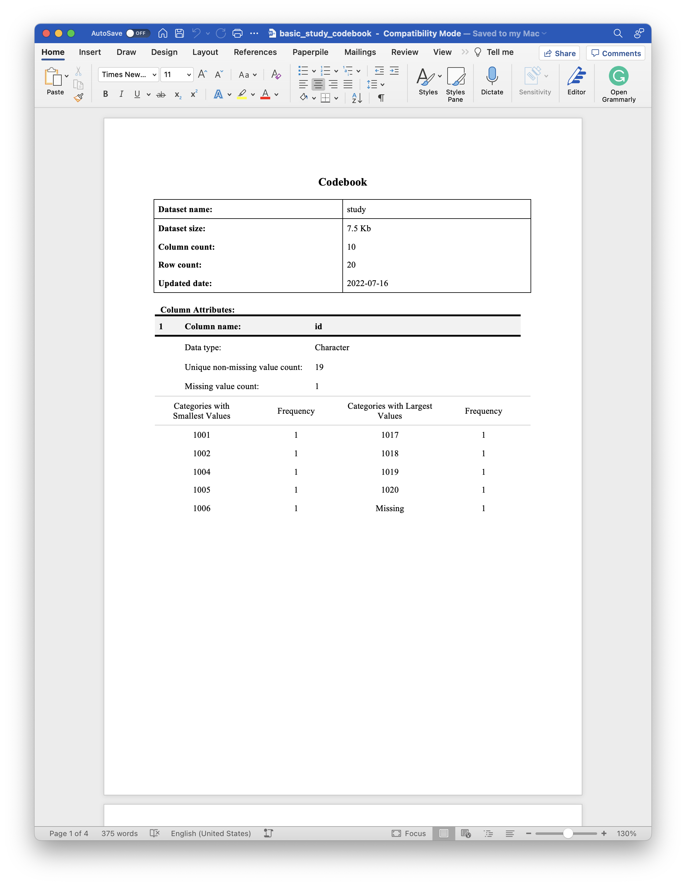
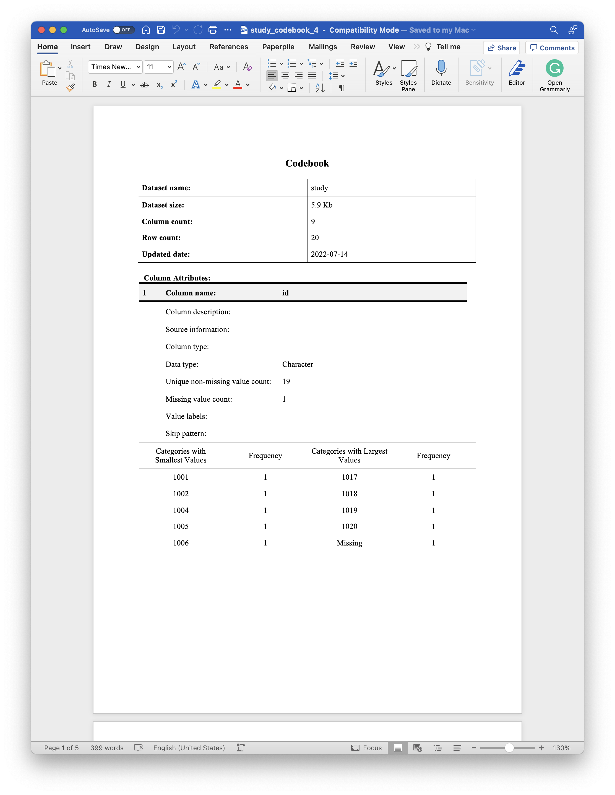
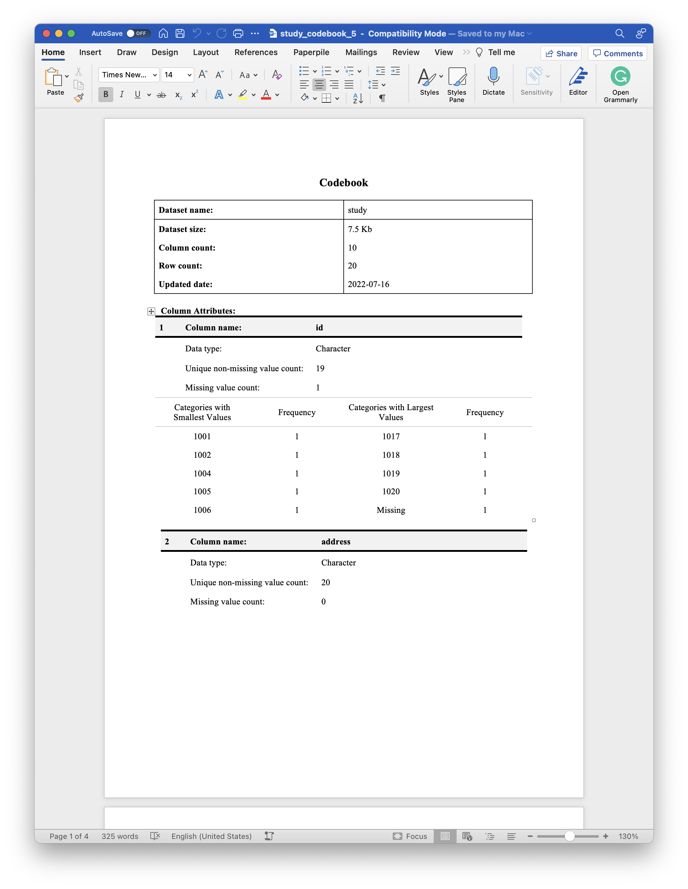

# codebookr 

The `codebookr` package is intended to make it easy for users to create
codebooks (also called data dictionaries) directly from an R data frame.

Under the hood, `codebookr` uses the
[flextable](https://ardata-fr.github.io/flextable-book/) and
[officer](https://davidgohel.github.io/officer/index.html) packages
extensively to create the codebook as a Word document.

## Installation

You can install the released version of `codebookr` from
[CRAN](https://CRAN.R-project.org) with:

``` r
install.packages("codebookr")
```

And the development version from [GitHub](https://github.com/) with:

``` r
# install.packages("devtools")
devtools::install_github("brad-cannell/codebookr")
```

## codebookr functions

- **codebook:** The
  [`codebook()`](https://brad-cannell.github.io/codebookr/reference/codebook.md)
  function assists with the creation of a codebook for a given R data
  frame.

- **cb_add_col_attributes:** This is a helper function that makes it
  easier to add arbitrary attributes to R data frame columns (e.g.,
  description, source, column type). These attributes can later be
  accessed by the
  [`codebook()`](https://brad-cannell.github.io/codebookr/reference/codebook.md)
  function to fill in the column attributes table for each column in the
  codebook.

## Example 1: The most basic use case

We will start by demonstrating a complete, bare minimum example without
any modification to our example data or any of the default values in the
[`codebook()`](https://brad-cannell.github.io/codebookr/reference/codebook.md)
function. After walking through this example, we will demonstrate
several ways to improve the codebook document by adding attributes to
our data frame. We will also demonstrate the effects of adjusting some
of
[`codebook()`](https://brad-cannell.github.io/codebookr/reference/codebook.md)s
default values. Finally, we will demonstrate some techniques to make the
codebook creation process more efficient in a couple of common use
cases.

Let’s start by loading `codebookr` and `dplyr`.

``` r
library(codebookr)
library(dplyr, warn.conflicts = FALSE)
library(haven)
```

### Load data

For the purposes of making a self-contained example, the `codebookr`
package comes with a small example data frame that is intended to have
some of the features of real study data. We will use it to demonstrate
how to use `codebookr` below.

``` r
# Load example data
data(study)
```

``` r
glimpse(study)
#> Rows: 20
#> Columns: 10
#> $ id        <chr> "1001", "1002", NA, "1004", "1005", "1006", "1007", "1008", …
#> $ address   <chr> "101 A st.", "101 B st.", "101 C st.", "101 D st.", "101 E s…
#> $ sex       <fct> Female, Female, Female, NA, Female, Male, Male, Male, Female…
#> $ date      <date> 2021-10-12, 2021-09-23, 2021-10-13, 2021-10-19, NA, 2021-10…
#> $ time      <time> 08:56:40, 13:26:09, 09:24:22, 08:37:26, 09:20:59, 11:14:52,…
#> $ date_time <dttm> 2021-10-12 08:56:40, 2021-09-23 13:26:09, 2021-10-13 09:24:…
#> $ days      <int> 3, 15, 21, 5, 8, NA, 10, 18, 10, 12, 2, 10, 12, 20, 14, 17, …
#> $ height    <dbl> 81.25571, 68.15227, 58.79282, 72.81303, 69.61109, 71.05764, …
#> $ likert    <int> 5, 3, 4, 4, 1, 4, 1, 3, 4, 3, 5, 4, 4, 4, 1, 2, 3, 4, 3, 1
#> $ outcome   <lgl> TRUE, FALSE, FALSE, TRUE, TRUE, FALSE, TRUE, TRUE, FALSE, FA…
```

### Pass the data frame to the `codebook` function

In this first example, we will simply pass the `study` data frame to the
[`codebook()`](https://brad-cannell.github.io/codebookr/reference/codebook.md)
function without making any alterations. We will save the resulting
`rdocx` object (described in greater detail below) in our global
environment as the `study_codebook` object.

``` r
study_codebook <- codebook(study)
```

### Create the Word codebook document

Finally, we will pass the `study_codebook` object we just created to the
[`print()`](https://rdrr.io/r/base/print.html) function along with the
path to Word document we want to create.

``` r
print(study_codebook, "basic_study_codebook.docx")
```

Alternatively, you can generate the rdocx file and print it as a Word
document in one step like this.

``` r
print(codebook(study), "basic_study_codebook.docx")
```

The code above produces the following document, which you can click to
view/download on Dropbox. You may also download it from the files pane
above.

[](https://www.dropbox.com/s/qcijxgyeh4ib4d3/basic_study_codebook.docx?dl=0)

As you may see in the example document above, the default codebook
document includes two major sections. They are:

1.  A **metadata table**. This table includes some metadata about the
    data frame. Currently, the data frame’s name, size, number of
    columns, and number of rows are included in the metadata table. The
    final row of the metadata table gives the date when the codebook
    (but not necessarily the data frame) was last updated.

2.  The **column attributes tables**. The codebook will include a tables
    of column attributes for each column in the data frame passed to the
    [`codebook()`](https://brad-cannell.github.io/codebookr/reference/codebook.md)
    function. By default, the top half of the column attributes table
    includes the column’s name, data type, the number of unique
    non-missing values, and the total number of missing values. Below,
    we will discuss other optional attributes that may be added to this
    table. The bottom half of each column attributes table will include
    some basic descriptive statistics. Which statistics are displayed
    depends on the what type of data the column contains. This is
    discussed in greater detail below.

    - The value for `Data type` is just the value returned by passing
      the column to base R’s
      [`class()`](https://rdrr.io/r/base/class.html) function. Below, we
      will discuss adding the `Column type` attribute, which allows the
      user to add additional information about the values in each
      column.

## Example 2: A more informative codebook

The previous example gave us a complete codebook, but there’s a lot of
room for improvement. This example is still pretty simple, but it
demonstrates how to use the `codebookr` package to make a codebook from
a **labeled** data frame.

Once again, we will begin by loading the example `study` data.

``` r
# Load example data
data(study)
```

``` r
glimpse(study)
#> Rows: 20
#> Columns: 10
#> $ id        <chr> "1001", "1002", NA, "1004", "1005", "1006", "1007", "1008", …
#> $ address   <chr> "101 A st.", "101 B st.", "101 C st.", "101 D st.", "101 E s…
#> $ sex       <fct> Female, Female, Female, NA, Female, Male, Male, Male, Female…
#> $ date      <date> 2021-10-12, 2021-09-23, 2021-10-13, 2021-10-19, NA, 2021-10…
#> $ time      <time> 08:56:40, 13:26:09, 09:24:22, 08:37:26, 09:20:59, 11:14:52,…
#> $ date_time <dttm> 2021-10-12 08:56:40, 2021-09-23 13:26:09, 2021-10-13 09:24:…
#> $ days      <int> 3, 15, 21, 5, 8, NA, 10, 18, 10, 12, 2, 10, 12, 20, 14, 17, …
#> $ height    <dbl> 81.25571, 68.15227, 58.79282, 72.81303, 69.61109, 71.05764, …
#> $ likert    <int> 5, 3, 4, 4, 1, 4, 1, 3, 4, 3, 5, 4, 4, 4, 1, 2, 3, 4, 3, 1
#> $ outcome   <lgl> TRUE, FALSE, FALSE, TRUE, TRUE, FALSE, TRUE, TRUE, FALSE, FA…
```

### Column types

Although R recognizes many different column types, most of which the
`study` data contains,
[`codebook()`](https://brad-cannell.github.io/codebookr/reference/codebook.md)
classifies all columns as one of four types and uses these categories to
determine which descriptive statistics to use in the codebook document:

1.  **Categorical with many different categories**, for example the `id`
    column of the `study` data frame.  
2.  **Categorical with few different categories**, for example the `sex`
    column of the `study` data frame.  
3.  **Time**, for example the `date` column of the `study` data frame.  
4.  **Numeric**, for example the `height` column of the `study` data
    frame.

Here are the default summary statistics returned by the
[`codebook()`](https://brad-cannell.github.io/codebookr/reference/codebook.md)
function for each of the column types list above:

#### Categorical variables with many different categories

| lowest_cats | lowest_freq | highest_cats | highest_freq |
|:------------|------------:|:-------------|-------------:|
| 1001        |           1 | 1017         |            1 |
| 1002        |           1 | 1018         |            1 |
| 1004        |           1 | 1019         |            1 |
| 1005        |           1 | 1020         |            1 |
| 1006        |           1 | Missing      |            1 |

#### Categorical variables with few different categories

| cat     | n   | cum_freq | percent |
|:--------|:----|:---------|:--------|
| Female  | 11  | 11       | 55.00   |
| Male    | 8   | 19       | 40.00   |
| Missing | 1   | 20       | 5.00    |

#### Date/Time variables

| Statistic | Value      | Frequency | Percentage |
|:----------|:-----------|:----------|:-----------|
| Minimum   | 2021-09-21 | 2         | 10.00      |
| Mode      | 2021-09-23 | 3         | 15.00      |
| Maximum   | 2021-10-26 | 2         | 10.00      |

#### Numeric variables

| Min   | Mean  | Median | Max   | SD   |
|:------|:------|:-------|:------|:-----|
| 58.79 | 73.54 | 73.39  | 84.61 | 6.90 |

### Add column attributes to the data frame you want to document with a codebook

Typically, though not necessarily (see [What if the variables already
have labels?](#already-labeled%7D)), the first step in creating your
codebook will be to add column attributes to your data. The
[`cb_add_col_attributes()`](https://brad-cannell.github.io/codebookr/reference/cb_add_col_attributes.md)
function is a convenience function that allows you to add arbitrary
attributes to the columns of the data frame. These attributes can later
be accessed to fill in the column attributes table of the codebook
document. Column attributes *can* serve a similar function to variable
labels in SAS or Stata; however, you can assign many different
attributes to a column and they can contain any kind of information you
want.

The arguments to
[`cb_add_col_attributes()`](https://brad-cannell.github.io/codebookr/reference/cb_add_col_attributes.md)
are:

- **df:** The data frame containing the column you want to add the
  attribute to.  
- **.x:** The name of the column you want to add the attribute to in
  `df`.  
- **…:** Arbitrary list of attributes in the form `attribute = "value"`.

Although the
[`cb_add_col_attributes()`](https://brad-cannell.github.io/codebookr/reference/cb_add_col_attributes.md)
function will allow you to add any attributes you want, there are
currently **only five** special attributes that the
[`codebook()`](https://brad-cannell.github.io/codebookr/reference/codebook.md)
function will recognize and add to the column attributes table of the
codebook document. They are:

- **description**: Although you may add any text you desire to the
  `description` attribute, it is intended to be used describe the
  question/process that generated the data contained in the column. Many
  statistical software packages refer to this as a variable label.

  - As [demonstrated below](#already-labeled), if the data was imported
    from SAS, Stata, or SPSS with variable labels using the `haven`
    package, `codebook` will automatically recognize them. There is no
    need to manually create them. However, you may overwrite the
    imported variable label for any column by adding a `description`
    attribute as shown in the example below.

- **source**: Although you may add any text you desire to the `source`
  attribute, it is intended to be used describe where the data contained
  in the column originally came from. For example, if the current data
  frame was created by merging multiple data sets together, you may want
  to use the source attribute to identify the data set it originates
  from. As another example, if the current data frame contains
  longitudinal data, you may want to use the source attribute to
  identify the wave(s) in which data for this column was collected.

- **col_type**: The `col_type` attribute is intended to provide
  additional information above and beyond the `Data type` (i.e., column
  class) about the values in the column. For example, you may have a
  column of 0’s and 1’s, which will have a *numeric* data type. However,
  you may want to inform data users that this is really a dummy variable
  where the 0’s and 1’s represent discrete categories (No and Yes).
  Another way to think about it is that the `Data type` attribute is how
  *R* understands the column and the `Column type` attribute is how
  *humans* should understand the column. Currently accepted values are:
  `Numeric`, `Categorical`, or `Time`.

  - Perhaps even more importantly, setting the `col_type` attribute
    helps R determine which descriptive statistics to calculate for the
    bottom half of the column attributes table. Inside of the
    [`codebook()`](https://brad-cannell.github.io/codebookr/reference/codebook.md)
    function, the
    [`cb_add_summary_stats()`](https://brad-cannell.github.io/codebookr/reference/cb_add_summary_stats.md)
    function will attempt to figure out whether the column is
    **numeric**, **categorical - many categories (e.g. participant
    id)**, **categorical - few categories (e.g. sex)**, or **time -
    including dates**. Again, this matters because the table of summary
    stats shown in the codebook document depends on the value
    [`cb_add_summary_stats()`](https://brad-cannell.github.io/codebookr/reference/cb_add_summary_stats.md)
    chooses. However, the user can directly tell
    [`cb_add_summary_stats()`](https://brad-cannell.github.io/codebookr/reference/cb_add_summary_stats.md)
    which summary stats to calculate by providing a `col_type` attribute
    to a column with one of the following values: `Numeric`,
    `Categorical`, or `Time`.

- **value_labels**: Although you may pass any named vector you desire to
  the `value_labels` attribute, it is intended to inform your data users
  about how to correctly interpret numerically coded categorical
  variables. For example, you may have a column of 0’s and 1’s that
  represent discrete categories (i.e., “No” and “Yes”) instead of
  numerical quantities. In many other software packages (e.g., SAS,
  Stata, and SPSS), you can layer “No” and “Yes” labels on top of the
  0’s and 1’s to improve the readability of your analysis output. These
  are commonly referred to as *value labels*. The R programming language
  does not really have value labels in the same way that other popular
  statistical software applications do. R users can (and typically
  should) coerce numerically coded categorical variables into
  [factors](https://www.r4epi.com/numerical-descriptions-of-categorical-variables.html#factor-vectors);
  however, coercing a numeric vector to a factor is not the same as
  adding value labels to a numeric vector because the underlying numeric
  values can change in the process of creating the factor. For this, and
  other reasons, many R programmers choose to create a *new* factor
  version of a numerically encoded variable as opposed to
  overwriting/transforming the numerically encoded variable. In those
  cases, you may want to inform your data users about how to correctly
  interpret numerically coded categorical variables. Adding value labels
  to your codebook is one way of doing so.

  - Add value labels to columns as a named vector to the `value_labels`
    attribute. For example, `value_labels` = c(“No” = 0, “Yes” = 1). As
    another example, you may view hypothetical value labels added to the
    `likert` column below.

  - As [demonstrated below](#already-labeled), if the data was imported
    from SAS, Stata, or SPSS with value labels using the `haven`
    package, `codebook` will automatically recognize them. There is no
    need to manually create them. However, you may overwrite the
    imported value labels for any column by adding a `value_labels`
    attribute as shown in the example below.

- **skip_pattern**: Although you may add any text you desire to the
  `skip_pattern` attribute, it is intended to be used describe skip
  patterns in the data collection tools that impact which study
  participants were exposed to each study item. For example, If the
  `likert` question in our hypothetical study data was only asked of
  participants who were enrolled in the study for at least 10 days, then
  you may want to add a note like “Not asked if days \< 10” to the skip
  pattern section of the column attributes table.

``` r
study <- study %>%
  cb_add_col_attributes(
    id,
    description = "Participant's study identification number",
    source = "Administrative data",
    other_attribute = "What happens?"
  ) %>%
  
  cb_add_col_attributes(
    address,
    description = "Participant's home address",
    source = "Administrative data"
  ) %>%

  cb_add_col_attributes(
    sex,
    description = "Biological sex of the participant assigned at birth",
    source = "Sociodemographic questionnaire"
  ) %>%

  cb_add_col_attributes(
    date,
    description = "Participant's date of enrollment",
    source = "Administrative data"
  ) %>%
  
  cb_add_col_attributes(
    time,
    description = "Participant's time of enrollemnt",
    source = "Administrative data"
  ) %>% 
  
  cb_add_col_attributes(
    days,
    description = "Total number of days the participant was enrolled in the study",
    source = "Calculated variable"
  ) %>% 

  cb_add_col_attributes(
    height,
    description = "Participant's height in inches at date of enrollment",
    source = "Anthropometric measurements"
  ) %>% 

  cb_add_col_attributes(
    likert,
    description = "An example Likert scale item",
    source = "Exposure questionnaire",
    value_labels = c(
      "Very dissatisfied" = 1, 
      "Somewhat dissatisfied" = 2,
      "Neither satisfied nor dissatisfied" = 3,
      "Somewhat satisfied" = 4,
      "Very satisfied" = 5
    ),
    skip_pattern = "Not asked if days < 10"
  ) %>% 
    
  cb_add_col_attributes(
    outcome,
    description = "Participant experienced the outcome of interest",
    source = "Adjudicated outcomes data"
  )
#> The following attribute(s) are being added to a variable in the data frame for the first time: description, source, other_attribute. If you believe this/these attribute(s) were previously added, then check for a typo in the attribute name. If you are adding this/these attribute(s) for the first time, you can probably safely ignore this message.
#> The following attribute(s) are being added to a variable in the data frame for the first time: value_labels, skip_pattern. If you believe this/these attribute(s) were previously added, then check for a typo in the attribute name. If you are adding this/these attribute(s) for the first time, you can probably safely ignore this message.
```

Notice that
[`codebook()`](https://brad-cannell.github.io/codebookr/reference/codebook.md)
will print a message to the screen the first time you add an attribute
to any column in the data frame. This is intended to help you catch
typos. For example, if you add a `description` attribute to the column
`id` you will get the
`following attribute(s) are being added to a variable in the data frame for the first time`
message. Later, if you add a `description` attribute to any other
column, you should \*NOT\*\* get the
`following attribute(s) are being added to a variable in the data frame for the first time`
message again. However, if you accidentally added a `descriptionn` (typo
– two n’s) attribute to another column in the data frame then you would
get a message telling you that you added the `descriptionn` attribute
for the first time. Because
[`codebook()`](https://brad-cannell.github.io/codebookr/reference/codebook.md)
allows you to add any attribute to the data frame that you desire, it
can’t check to make sure the attributes you are adding are “valid”. The
best it can do is tell you when you are adding an attribute for the
first time, and let you investigate further if you believe that you
previously added that particular attribute.

### Create a Word codebook document

Now that we’ve added a couple of attributes the data frame we want to
document, we will once again pass the data frame to the
[`codebook()`](https://brad-cannell.github.io/codebookr/reference/codebook.md)
function.

The arguments to the
[`codebook()`](https://brad-cannell.github.io/codebookr/reference/codebook.md)
function are:

- **df:** The saved file at `path`, read into memory as a data frame.  
- **title:** An optional title that will appear at the top of the Word
  codebook document.  
- **subtitle:** An optional subtitle that will appear at the top of the
  Word codebook document.  
- **description:** An optional text description of the dataset that will
  appear on the first page of the Word codebook document.
- **keep_blank_attributes:** By default, the column attributes table
  will omit the Column description, Source information, Column type,
  value labels, and skip pattern rows from the column attributes table
  in the codebook document if those attributes haven’t been set. In
  other words, it won’t show blank rows for those attributes. Passing
  `TRUE` to the keep_blank_attributes argument will cause the opposite
  to happen. The column attributes table will include a Column
  description, Source information, Column type, value labels, and skip
  pattern row for every column in the data frame - even if they don’t
  have those attributes set.
- **no_summary_stats:** A character vector of column names. The summary
  statistics will not be added to column attributes table for any column
  passed to this argument. This can be useful when a column contains
  values that are sensitive or may be used to identify individual people
  (e.g., names, addresses, etc.) and the individual values for that
  column should not appear in the codebook.

First, we will once again create our codebook without passing any values
to the `title`, `subtitle`, or `description` arguments. This will allow
us to more easily see only the changes that were made to our codebook as
a result of adding attributes to the columns. After viewing those
changes, we will add a title, subtitle, and description.

``` r
study_codebook <- codebook(df = study)
```

Technically, the
[`codebook()`](https://brad-cannell.github.io/codebookr/reference/codebook.md)
function returns an [rdocx
object](https://davidgohel.github.io/officer/reference/read_docx.html)
that can be printed to a Word document. This functionality comes from
[David Gohel’s incredible `officer`
package](https://davidgohel.github.io/officer/index.html). The final
step in creating the Word document is to
[print](https://davidgohel.github.io/officer/reference/read_docx.html)
it.

``` r
print(x = study_codebook, target = "study_codebook_1.docx")
```

Where `x` is the rdocx object and `target` is a path for the Word
document you want to create (which may or may not already exist). The
code above produces the following document, which you can click to
view/download on Dropbox. You may also download it from the files pane
above.

[](https://www.dropbox.com/s/tjzayqh0sdytjz4/study_codebook_1.docx?dl=0)

In the example above, the title and metadata table are unchanged
compared to [Example 1](#example-1-the-most-basic-use-case). However,
the column attributes tables now look a little different.

- Notice that the **column attributes tables** for each variable now
  includes the attributes that we [added as column attributes
  above](#add-column-attributes-to-the-data-frame-you-want-to-document-with-a-codebook).

- Notice that we added an `other_attribute = "What happens?"` attribute
  to the `id` column when we [added column attributes
  above](#add-column-attributes-to-the-data-frame-you-want-to-document-with-a-codebook).
  That attribute is still attached to the `id` column, but it is ignored
  by
  [`codebook()`](https://brad-cannell.github.io/codebookr/reference/codebook.md).
  Again, there are currently **only five** special attributes that the
  [`codebook()`](https://brad-cannell.github.io/codebookr/reference/codebook.md)
  function will recognize and add to the column attributes table of the
  codebook document – `description`, `source`, `col_type`,
  `value_labels`, and `skip_pattern`.

- Notice that
  [`codebook()`](https://brad-cannell.github.io/codebookr/reference/codebook.md)
  guessed what type of values were contained in each column and returned
  the most useful descriptive statistics for that type. In this case we
  are may be very happy with these guesses. But what if we weren’t? For
  example, what if we would prefer for
  [`codebook()`](https://brad-cannell.github.io/codebookr/reference/codebook.md)
  to treat the `likert` column as categorical data instead of numeric
  data? We can do so by simply adding the `col_type = "Categorical"`
  attribute as demonstrated below.

``` r
study <- study %>%
  cb_add_col_attributes(
    likert,
    col_type = "Categorical"
  )
#> The following attribute(s) are being added to a variable in the data frame for the first time: col_type. If you believe this/these attribute(s) were previously added, then check for a typo in the attribute name. If you are adding this/these attribute(s) for the first time, you can probably safely ignore this message.
```

``` r
print(x = codebook(study), target = "study_codebook_2.docx")
```

The code above produces the following document, which you can click to
view/download on Dropbox. You may also download it from the files pane
above.

[](https://www.dropbox.com/s/l2mph09x48q5cya/study_codebook_2.png?dl=0)

As shown in the codebook above, the bottom half of the column attributes
table now shows the frequency, cumulative frequency, and percentage for
each value in the `likert` column. You may also notice that the
`value_labels` and `skip_pattern` we applied above are also displayed in
the column attributes table.

### Add title, subtitle, and description

As previously mentioned, we can optionally add a custom title and
subtitle to our codebook. We can also optionally add some descriptive
text about our data overall. Doing so is straight forward. Just pass a
string of text to each of the `title`, `subtitle`, and/or `description`
arguments of the
[`codebook()`](https://brad-cannell.github.io/codebookr/reference/codebook.md)
function. In the example below, we use a description from the [DETECT
project](https://github.com/brad-cannell/detect_pilot_test_5w) for
example purposes only.

``` r
study_codebook <- codebook(
  df = study,
  title = "My Example Study",
  subtitle = "A Subtitle for My Example Study Codebook",
  description = "In collaboration with Texas Adult Protective Services (APS) and one of the largest mobile healthcare providers in North Texas — MedStar Mobile Healthcare (MedStar) — our team developed and piloted an EA screening tool: Detection of Elder Abuse Through Emergency Care Technicians (DETECT). The DETECT tool was designed specifically to help medics identify potential EA among community-dwelling older adults during an emergency response. DETECT relies entirely on the medics’ systematic observations of the older adults’ physical and social environment — no direct questioning of the older adult or their caregivers is involved. The intent was to create an EA screening tool that was easy for medics to use in the field and that helped medics capture information about older adults, their environments, and their caregivers that is thought to be associated with the occurrence of EA. 

We pilot tested using the DETECT screening tool with medics in the field between September 17th and October 26th, 2015. During the pilot test, MedStar’s Electronic Patient Care Reporting system (ePCR) was programmed to automatically prompt all medics to complete an EA screening using the DETECT tool while on an eligible 911 response. An eligible 911 response was defined as a call for a community-dwelling patient who was 65 years of age or older, the setting was the patient’s residence, and the patient resided in the community (e.g., private home, unlicensed adult foster homes, unlicensed board and care homes, etc.). Other types of residences (e.g., licensed skilled nursing facilities) were excluded because reports of EA in these settings are generally not investigated by APS in Texas. By definition, older adults who participated in the pilot study had to live in MedStar’s service area of an estimated (978,000 residents), which included Fort Worth, Texas, and 14 surrounding communities."
)
```

``` r
print(study_codebook, "study_codebook_3.docx")
```

The code above produces the following document, which you can click to
view/download on Dropbox. You may also download it from the files pane
above.

[](https://www.dropbox.com/s/ysz53v23kinr9ht/study_codebook_3.png?dl=0)

As shown in the codebook above, the codebook now contains a title,
subtitle, and description.

## What if you have a lot of variables?

If you have a lot of variables that you want to set attributes for, it
can be tedious to manually type
[`cb_add_col_attributes()`](https://brad-cannell.github.io/codebookr/reference/cb_add_col_attributes.md)
for each of the variables [like we did
above](#add-column-attributes-to-the-data-frame-you-want-to-document-with-a-codebook).

Below, we demonstrate two techniques that can reduce some of the pain.
Perhaps we will develop even better methods in the future.

``` r
# Load study again to remove the attributes we added above
data(study)
```

In the first example, we demonstrate setting an attribute for many
variables at once. Let’s say that we want to set the `source` attribute
to “Administrative Data” for the `id`, `date`, and `time` columns. We
could do so with three separate calls to
[`cb_add_col_attributes()`](https://brad-cannell.github.io/codebookr/reference/cb_add_col_attributes.md)
for each variable [as we did
above](#add-column-attributes-to-the-data-frame-you-want-to-document-with-a-codebook),
but that becomes a less tractable solution with many more than a handful
of columns.

As a more efficient solution, we can create a vector of column names
that we want to add an attribute to and then set the attribute value for
each column in a `for` loop. We could just manually type the vector of
column names, but we prefer using `dplyr`’s
[`select()`](https://dplyr.tidyverse.org/reference/select.html) function
as shown below because it is safer (e.g., it will throw an error if we
type a variable name that doesn’t exist) and it offers the convenience
of allowing us to use [tidy-select selection
features](https://dplyr.tidyverse.org/reference/dplyr_tidy_select.html).

``` r
admin_vars <- study %>% 
  select(id, date, time) %>% 
  names()

for(i in admin_vars) {
  attr(study[[i]], "source") <- "Administrative data"
}
```

``` r
attributes(study$id)
#> $source
#> [1] "Administrative data"
```

``` r
attributes(study$date)
#> $class
#> [1] "Date"
#> 
#> $source
#> [1] "Administrative data"
```

``` r
attributes(study$time)
#> $units
#> [1] "secs"
#> 
#> $class
#> [1] "hms"      "difftime"
#> 
#> $source
#> [1] "Administrative data"
```

In this second example, we will use a for loop to actually help us write
a section of
[`cb_add_col_attributes()`](https://brad-cannell.github.io/codebookr/reference/cb_add_col_attributes.md)
code for each column in the data set. When we run the code chunk below,
it will print R code to the screen that we can copy and paste into a
second code chunk. This will cut down on the amount of typing we have to
do and help ensure that we don’t accidentally forget to add attributes
to any of the columns.

``` r
for (i in seq_along(names(study))) {
  cat(paste0('
    codebook_add_col_attributes( \n    ',
      "  ", names(study)[i], ', \n    ',
      "  ", 'description = ""
    ) %>%
  '))
}
#> 
#>     codebook_add_col_attributes( 
#>       id, 
#>       description = ""
#>     ) %>%
#>   
#>     codebook_add_col_attributes( 
#>       address, 
#>       description = ""
#>     ) %>%
#>   
#>     codebook_add_col_attributes( 
#>       sex, 
#>       description = ""
#>     ) %>%
#>   
#>     codebook_add_col_attributes( 
#>       date, 
#>       description = ""
#>     ) %>%
#>   
#>     codebook_add_col_attributes( 
#>       time, 
#>       description = ""
#>     ) %>%
#>   
#>     codebook_add_col_attributes( 
#>       date_time, 
#>       description = ""
#>     ) %>%
#>   
#>     codebook_add_col_attributes( 
#>       days, 
#>       description = ""
#>     ) %>%
#>   
#>     codebook_add_col_attributes( 
#>       height, 
#>       description = ""
#>     ) %>%
#>   
#>     codebook_add_col_attributes( 
#>       likert, 
#>       description = ""
#>     ) %>%
#>   
#>     codebook_add_col_attributes( 
#>       outcome, 
#>       description = ""
#>     ) %>%
#> 
```

## What if the variables already have labels?

It’s possible that you’re data already has column attributes that you
want
[`codebook()`](https://brad-cannell.github.io/codebookr/reference/codebook.md)
to use. For example, you may have a data frame that is imported from a
binary file created by statistical analysis software other than R. In
many cases, useful attributes such as variable labels and value labels
are imported with the data.

In the example below, we import the same study data that we worked with
above. However, this time we are importing it from a Stata data file
using the
[`read_dta()`](https://haven.tidyverse.org/reference/read_dta.html)
function from the [haven](https://haven.tidyverse.org/) package.

``` r
study <- read_dta("inst/extdata/study.dta")
```

As shown below, if value labels, variable labels, and/or formats were
added to the data in SAS, Stata, or SPSS then `haven` will attach them
to the imported columns as `label`, `format`, and `labels` attributes
respectively.

``` r
attributes(study$sex)
#> $label
#> [1] "Biological sex of the participant assigned at birth"
#> 
#> $format.stata
#> [1] "%8.0g"
#> 
#> $class
#> [1] "haven_labelled" "vctrs_vctr"     "double"        
#> 
#> $labels
#> Female   Male 
#>      1      2
```

Additionally, `haven` will add the `haven_labelled` and `vctrs_vctr`
class to any column that has *value labels*.

``` r
class(study$sex)
#> [1] "haven_labelled" "vctrs_vctr"     "double"
```

Fortunately, because we so often work with SAS, Stata, and SPSS data
imported into R using `haven`, `codebookr` is built to take advantage of
these imported attributes. Specifically, the
[`codebook()`](https://brad-cannell.github.io/codebookr/reference/codebook.md)
function will add the value labels and variable labels to the column
attributes table in the codebook document.

All we need to do is pass the data frame to the
[`codebook()`](https://brad-cannell.github.io/codebookr/reference/codebook.md)
function and print the `rdocx` object as before.

``` r
print(codebook(study), "stata_codebook_1.docx")
```

The code above produces the following document, which you can click to
view/download on Dropbox. You may also download it from the files pane
above.

[](https://www.dropbox.com/s/0ny97mwqhrc0eom/stata_codebok.png?dl=0)

As shown in the codebook above, the `Column description` portion of the
column attributes table is automatically populated with the value of the
each column’s `label` attribute. Additionally, the `Value labels`
portion of the column attributes table is automatically populated with
the value of each column’s `labels` attribute; although, only the `sex`
column has a `labels` attribute in this data frame.

### What happens if there is a label and a description attribute?

For example, the `id` column below was imported with a `label`
attribute. In the code chunk below, we also add a `description`
attribute. Which one will end up in the codebook document?

``` r
study <- study %>% 
  cb_add_col_attributes(id, description = "My new description")
#> The following attribute(s) are being added to a variable in the data frame for the first time: description. If you believe this/these attribute(s) were previously added, then check for a typo in the attribute name. If you are adding this/these attribute(s) for the first time, you can probably safely ignore this message.
```

``` r
attributes(study$id)
#> $label
#> [1] "Participant's study identification number"
#> 
#> $format.stata
#> [1] "%9s"
#> 
#> $description
#> [1] "My new description"
```

``` r
print(codebook(study), "stata_codebook_2.docx")
```

The code above produces the following document, which you can click to
view/download on Dropbox. You may also download it from the files pane
above.

[](https://www.dropbox.com/s/05myqf3mqbig43s/stata_codebook_2.png?dl=0)

As shown in the codebook above, the `Column description` portion of the
column attributes table is still automatically populated with the value
of the each column’s `label` attribute – **except where we manually
added a description attribute**. So, when a column has both a `label`
and a `description` attribute, the `description` attribute wins out. The
idea is that if we have taken the time to manually type out a
`description`, it should win out over whatever happened to be in
`label`.

### What happens if there is a labels and a value_labels attribute?

The `labels` and `value_labels` attributes behave similarly to the
`label` and `descripion` attributes shown above. The `Value labels:`
portion of the column attributes table will automatically be populated
with the value of the each column’s `labels` attribute – **except where
we manually add a value_labels attribute**. So, when a column has both a
`labels` and a `value_labels` attribute, the `value_labels` attribute
wins out. The idea is that if we have taken the time to manually type
out `value_labels`, it should win out over whatever happened to be in
`label`.

## Manually filling in the column attributes table

By default,
[`codebook()`](https://brad-cannell.github.io/codebookr/reference/codebook.md)
will drop `Column description:`, `Source information:`, `Column type:`,
`Value labels:`, and/or `Skip pattern:` from the column attributes table
if values for those attributes don’t exist in the data frame. However,
some users have requested the option to keep them in the Word codebook
document with blank values so that that they can be filled in manually.
We believe that this is typically a bad practice because any change to
the data may require you to create a new codebook and fill-in the Word
document manually from scratch again. However, changing the value of
`keep_blank_attributes` from `FALSE` to `TRUE` will cause
[`codebook()`](https://brad-cannell.github.io/codebookr/reference/codebook.md)
to keep `Column description:`, `Source information:`, `Column type:`,
`Value labels:`, and `Skip pattern:` in the column attributes table even
if those attributes don’t exist in the data frame.

``` r
# Refresh data
data(study)
```

``` r
study_codebook <- codebook(study, keep_blank_attributes = TRUE)
```

``` r
print(study_codebook, "study_codebook_4.docx")
```

The code above produces the following document, which you can click to
view/download on Dropbox. You may also download it from the files pane
above.

[](https://www.dropbox.com/s/bnkz2hqc2huqa3e/study_codebook_4.docx?dl=0)

As shown in the screenshot above, all rows of the column attributes
table now exist in the codebook document for each column of the data
frame. However, the values are blank where relevant attributes were not
set.

## Preventing summary statistics from appearing in the column attributes table

There may be times when a column contains values that are sensitive or
may be used to identify individual people (e.g., names, addresses, etc.)
and the individual values for that column should not appear in the
codebook. For example, the study data includes an address column. If we
wanted to make the codebook for the study data available to the public,
but not the data itself, we may not want the individual addresses to
show in the summary statistics portion of the column attributes table as
they do by default.


Of course, we could just drop the address column from the data frame
entirely, but it’s better to have the codebook acknowledge all of the
columns that exist in the data frame. In cases like this, we can pass a
character vector of column names to the `no_summary_stats` argument of
the
[`codebook()`](https://brad-cannell.github.io/codebookr/reference/codebook.md)
function. Doing so will prevent the summary statistics from being added
to column attributes table for any column passed to this argument.

``` r
study_codebook <- codebook(study, no_summary_stats = "address")
```

``` r
print(study_codebook, "study_codebook_5.docx")
```

[](https://www.dropbox.com/s/bnkz2hqc2huqa3e/study_codebook_4.docx?dl=0)

As shown in the screenshot above, the column attributes table for the
`address` column no longer shows any of the individual addresses.

Further, we can omit the summary statistics for all of the columns in
our data frame using the following code.

``` r
codebook(study, no_summary_stats = names(study))
```
